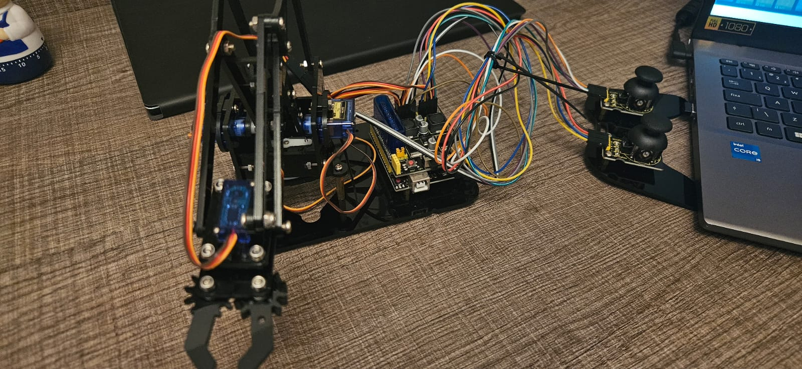
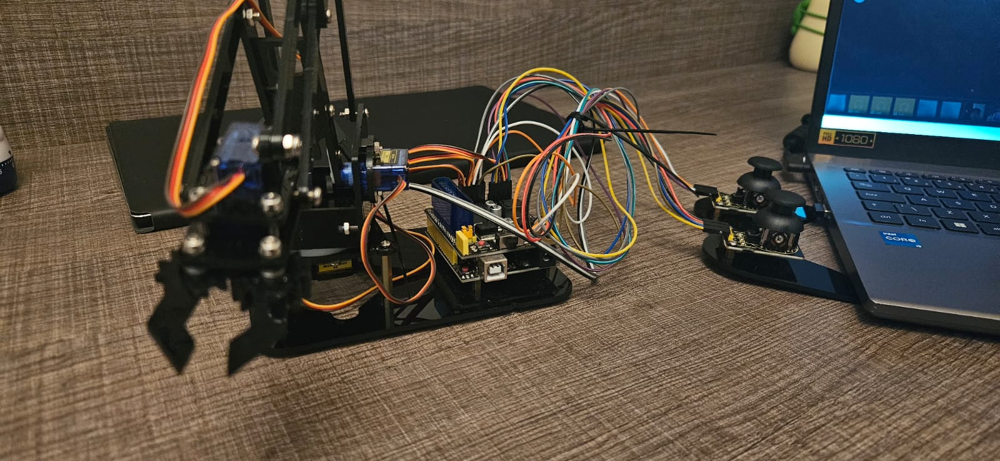
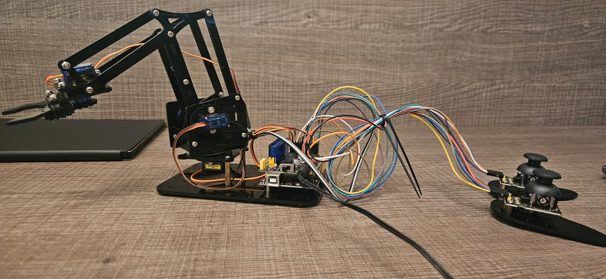

# 🤖 Garra Mecânica com Arduino + Joysticks

Este é o meu primeiro projeto de robótica, e marca o início da minha jornada prática nesse universo enorme da robótica! Sempre fui apaixonado por sistemas autônomos, controle de movimentos e tudo que envolve a integração entre hardware e software. Desenvolvi e montei esta garra mecânica do zero, utilizando um braço robótico com 4 graus de liberdade controlado por dois joysticks analógicos, tudo programado na IDE do Arduino.

Este projeto representa não só a base física da robótica, mas também um passo fundamental para alcançar objetivos mais avançados, como o domínio de softwares e frameworks profissionais como o ROS 2 (Robot Operating System), onde pretendo me aprofundar em arquitetura de sistemas distribuídos, navegação autônoma e inteligência embarcada.

---

## 🛠️ Projeto Montado





---

## 🎯 Objetivo

Controlar os movimentos de um braço robótico com 4 servos de forma manual e precisa, com resposta rápida via dois joysticks — ideal para treinar coordenação de movimentos e lógica de automação.

---

## ⚙️ Componentes Utilizados

| Componente                         | Descrição |
|-----------------------------------|-----------|
| **V4.0 Control Board**            | Placa baseada em Arduino com entradas analógicas e digitais. Responsável por todo o controle do projeto. |
| **Servo Driver Expansion Board**  | Shield que distribui energia e facilita o controle de múltiplos servos com alimentação separada. |
| **4x Servomotores**               | Motores usados para movimentar base, extensão, altura e garra. |
| **2x Módulos Joystick Analógico** | Cada módulo possui dois eixos (X e Y), controlando dois servos por vez. |
| **Fonte externa + Jumpers**       | Alimentação externa para evitar sobrecarga no USB do computador. |
| **Estrutura do braço mecânico**   | Montada em acrílico, com articulações fixadas por parafusos. |

---

## 🧠 Lógica do Código

- O joystick **direito** controla:
  - Eixo X → Gira a **base** (servo1)
  - Eixo Y → Move a **extensão** do braço (servo2)
- O joystick **esquerdo** controla:
  - Eixo X → Ajusta a **altura** (servo3)
  - Eixo Y → Abre/fecha a **garra** (servo4)
- Leitura analógica contínua com delay de 50ms
- Limites de movimentação protegidos no código para evitar danos mecânicos

---

## 📁 Estrutura do Projeto

```
Garra_Mecanica_Arduino/
├── garra_mecanica.ino
├── README.md
├── LICENSE
├── Garra1.jpeg
├── Garra2.jpeg
├── Garra3.jpeg
└── ControlesGarra.jpeg
```

---

## 🚀 Como Usar

1. Instale a biblioteca `VarSpeedServo` na IDE do Arduino
2. Conecte os servos e joysticks conforme o esquema do código
3. Faça upload do sketch para a placa
4. Abra o Monitor Serial para depuração e pronto!

---

## 🎥 Demonstração do Projeto

[](https://youtu.be/mh5qwwwUMws)


---

## 👨‍💻 Autor

Desenvolvido por [**Miguel Gengo**](https://www.linkedin.com/in/miguel-gengo-8157b72a1)  
> Este projeto representa meu **primeiro passo na robótica** — e tenho orgulho de compartilhar essa conquista aqui no GitHub!

---

Sinta-se à vontade para abrir **issues**, **forks** ou enviar **pull requests** com melhorias 😄
